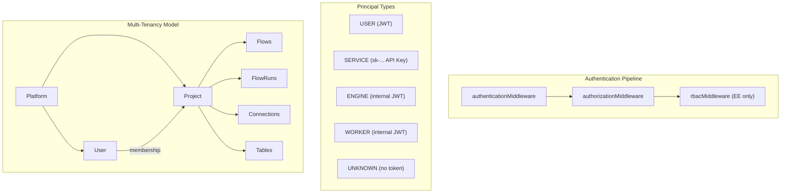
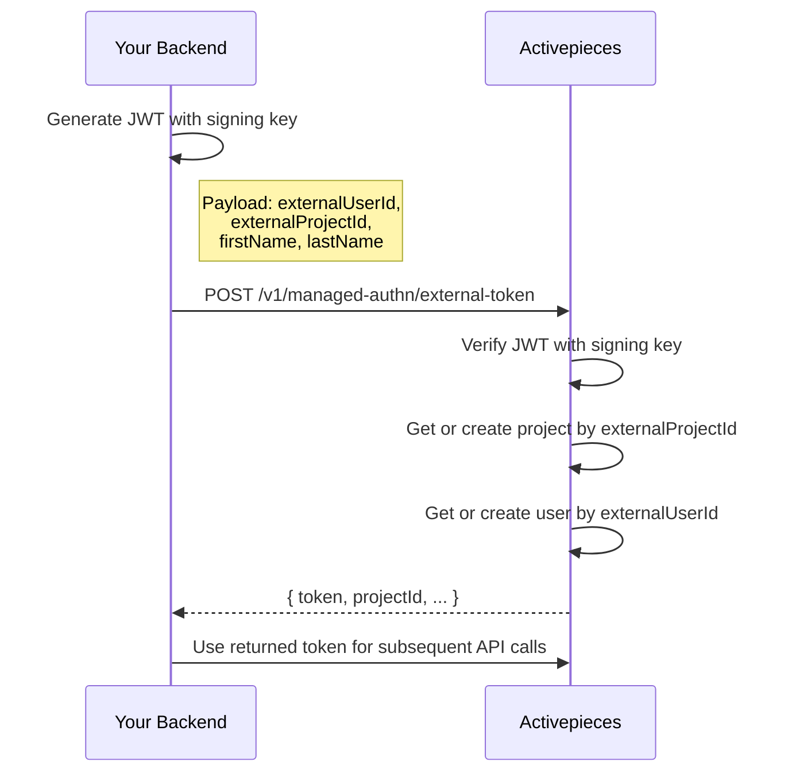
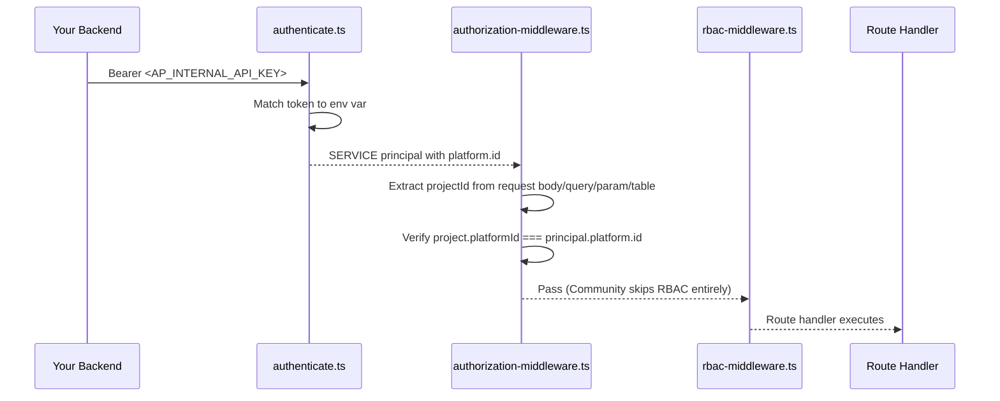
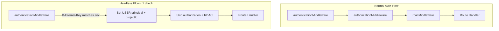
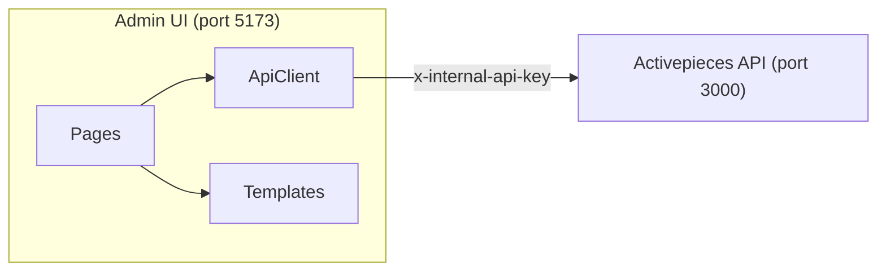
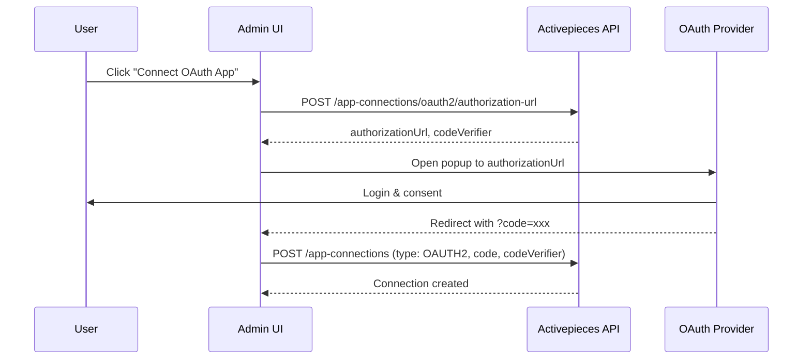

# Headless Activepieces Integration: Feasibility and Approach Analysis

## Current Architecture Summary




- **Platform** = top-level tenant (billing, auth config, branding)
- **Project** = workspace boundary (all flows, runs, connections scoped here)
- **User** = belongs to a platform, accesses projects via membership
- **API Keys (sk-)** = EE/Cloud only, platform-scoped `PrincipalType.SERVICE`

---

## Approach 1: Use EE Edition + Platform API Keys (Zero Code Changes)

**How it works:** Run AP with `AP_EDITION=ee`, create a platform API key (`sk-...`), and use it to call all APIs from your backend. Map your users/orgs to AP projects via `POST /v1/projects` (creates projects with `externalId`). Proxy all requests by forwarding `Authorization: Bearer sk-XXXX` and specifying `projectId` in requests.

**Pros:**

- Zero fork changes -- fully supported out-of-the-box
- API keys are platform-scoped; one key can access all projects under the platform
- Projects support `externalId` for mapping to your entities
- `PrincipalType.SERVICE` bypasses user membership checks and platform admin checks
- RBAC middleware is a no-op for SERVICE principals on most routes

**Cons:**

- Requires EE license (`apiKeysEnabled` must be true on the platform plan, which requires a license key from Activepieces)
- You are running EE code, which is under the [Activepieces Enterprise License](packages/ee/LICENSE), not MIT

**Proxy pattern:**

```
Your Backend                    Activepieces (EE)
-----------                    -----------------
POST /your-api/flows  ------>  POST /v1/flows
  Header: Bearer sk-XXXX         (projectId in body/query)
GET /your-api/runs    ------>  GET /v1/flow-runs?projectId=XXX
  Header: Bearer sk-XXXX
```

**Key files:**

- `[packages/server/api/src/app/ee/api-keys/api-key-service.ts](packages/server/api/src/app/ee/api-keys/api-key-service.ts)` -- API key creation/validation
- `[packages/server/api/src/app/core/security/v2/authn/authenticate.ts](packages/server/api/src/app/core/security/v2/authn/authenticate.ts)` -- `sk-` prefix routes to SERVICE principal
- `[packages/server/api/src/app/ee/projects/platform-project-controller.ts](packages/server/api/src/app/ee/projects/platform-project-controller.ts)` -- project CRUD with `externalId`

---

## Approach 2: Custom Auth Bypass Middleware (Minimal Fork Change)

**How it works:** Add a single new authentication mode that trusts a shared secret header (like the existing admin API pattern) and injects a synthetic `SERVICE` principal. This is a ~50 line change in 2-3 files.

**What to change:**

1. Add a new env var `AP_INTERNAL_API_KEY` in `[system-props.ts](packages/server/api/src/app/helper/system/system-props.ts)`
2. Modify `[authenticate.ts](packages/server/api/src/app/core/security/v2/authn/authenticate.ts)` to check for the internal key before falling through to JWT/API key logic:

```typescript
// Before existing checks in authenticateOrThrow:
if (!isNil(rawToken) && rawToken.startsWith('Bearer ap-internal-')) {
    return createInternalPrincipal(rawToken.replace('Bearer ', ''), log)
}
```

The `createInternalPrincipal` function would verify the token matches `AP_INTERNAL_API_KEY` env var and return a `PrincipalType.SERVICE` principal with the platform ID (which you'd also configure via env or extract from a header like `X-Platform-Id`).

1. Register the community project module alongside the EE project module (or add a `POST /` route to community controller) so you can create multiple projects without neE edition.

**Pros:**

- Minimal code change (~50-100 lines across 2-3 files)
- Runs on Community edition (MIT license)
- No per-request DB lookup for API key validation
- Easy to maintain during fork syncs (changes are isolated)

**Cons:**

- Fork divergence (small but non-zero)
- No per-key audit trail (single shared secret)
- You must ensure AP is not publicly exposed (network-level isolation is mandatory)

**Key files to modify:**

- `[packages/server/api/src/app/core/security/v2/authn/authenticate.ts](packages/server/api/src/app/core/security/v2/authn/authenticate.ts)`
- `[packages/server/api/src/app/helper/system/system-props.ts](packages/server/api/src/app/helper/system/system-props.ts)`
- `[packages/server/api/src/app/app.ts](packages/server/api/src/app/app.ts)` (register `platformProjectModule` in community)

---

## Approach 3: Reverse Proxy with Token Injection (Zero Code Changes)

**How it works:** Your backend generates valid AP JWT tokens directly (using the same `JWT_SECRET` env var AP uses) and injects them into forwarded requests. AP validates them as normal USER or ENGINE tokens.

**How AP JWTs work** (from `[access-token-manager.ts](packages/server/api/src/app/authentication/lib/access-token-manager.ts)` and `[jwt-utils.ts](packages/server/api/src/app/helper/jwt-utils.ts)`):

- HS256 algorithm, issuer `activepieces`
- Payload shape: `{ id, type, platform: { id }, tokenVersion? }`
- For USER tokens, `assertUserSession` validates the user exists and `tokenVersion` matches

**Problem:** USER tokens require a real user row in DB with matching `tokenVersion`. If you skip that, the token validation fails. This means you'd need to:

1. Pre-create a "service user" in each platform
2. Generate tokens with that user's `id` and `tokenVersion`
3. Still need EE for multi-project support

**Pros:**

- No code changes to AP itself
- JWT generation is straightforward (HS256)

**Cons:**

- Fragile: depends on internal JWT implementation details that can change between versions
- USER tokens are validated against DB (user must exist, tokenVersion must match)
- Tight coupling to AP internals without any contract guarantee
- Still need EE for multi-project management

**Verdict:** Not recommended for production.

---

## Approach 4: Managed Auth (Embedding Pattern -- EE Only, Zero Fork Changes)

**How it works:** This is the official "embed Activepieces" pattern. Your backend creates a signing key pair, generates JWTs with your user/project mapping, and AP auto-provisions projects and users.

**Flow:**




**Key code:** `[managed-authn-service.ts](packages/server/api/src/app/ee/managed-authn/managed-authn-service.ts)` -- auto-creates projects and users based on `externalProjectId` / `externalUserId`.

**Pros:**

- Officially supported embedding pattern
- Auto-provisions projects and users (no separate project creation API needed)
- Maps `externalProjectId` to your org/workspace concept
- Returns a standard AP JWT token for subsequent API calls

**Cons:**

- Requires EE license
- Two-step process: first get a token, then use it for API calls (adds one extra round trip per session, can be cached)
- Returns a USER-scoped token (subject to RBAC), not a SERVICE token

---

## Recommended Approach

For your use case (headless, backend-to-backend, not publicly exposed, minimal fork changes):


| Criterion        | Approach 1 (EE API Keys) | Approach 2 (Custom Bypass)   | Approach 4 (Managed Auth) |
| ---------------- | ------------------------ | ---------------------------- | ------------------------- |
| Code changes     | None                     | ~50-100 lines                | None                      |
| License          | EE required              | MIT (Community)              | EE required               |
| Merge conflicts  | None                     | Minimal (2-3 files)          | None                      |
| Production-ready | Yes                      | Yes (with network isolation) | Yes                       |
| Multi-project    | Yes                      | Needs cherry-pick            | Yes (auto-provision)      |


**If you can get an EE license:** Use **Approach 1** (API keys). It is the cleanest path with zero code changes and full API coverage.

**If you want MIT/Community only:** Use **Approach 2** (custom auth bypass). The change is tiny and isolated to authentication entry points, making fork sync conflicts rare and easy to resolve.

---

## Faster Local Development Startup

The 30-50 second startup comes from multiple sources. Here are strategies ordered by impact:

### 1. Keep Postgres and Redis running persistently (saves ~5-15s)

The `docker-compose.dev.yml` already provides standalone Postgres/Redis. Keep them running permanently instead of starting/stopping with each dev session:

```bash
docker compose -f docker-compose.dev.yml up -d
```

If `AP_REDIS_TYPE` is `memory`, AP spins up an embedded Redis server each time. Switch to external Redis (the default when `AP_REDIS_URL` is set).

### 2. Skip migrations on restart (saves ~3-10s)

Migrations run every startup under a distributed lock (`[main.ts](packages/server/api/src/main.ts)` lines 58-64). After initial setup, most restarts don't need migrations. Add an env var like `AP_SKIP_MIGRATIONS=true` that bypasses the migration block:

```typescript
// In main.ts, wrap the migration call:
if (system.isApp() && !system.getBoolean(AppSystemProp.SKIP_MIGRATIONS)) {
    await distributedLock(...).runExclusive({ ... })
}
```

This is a ~5 line change.

### 3. Disable piece sync on startup (saves ~5-15s)

`[piece-sync-service.ts](packages/server/api/src/app/pieces/piece-sync-service.ts)` fetches piece metadata from Activepieces cloud on startup. Set `AP_PIECES_SYNC_MODE=NONE` or `OFFICIAL_AUTO` with caching to avoid the network call.

### 4. Use tsx watch (already configured)

The dev server already uses `tsx watch` for hot-reload. Ensure you're running via `npm run serve:backend` (or `turbo run serve --filter=api`) rather than doing a full `build` + `node dist/...`.

### 5. Run only what you need

For headless development, you only need the API server:

```bash
# Start only the API (no web UI, no separate worker)
turbo run serve --filter=api
```

`AP_CONTAINER_TYPE=WORKER_AND_APP` (default) means the API process also runs job consumers, so you don't need a separate worker process in dev.

### Summary of startup optimization (combined)


| Optimization              | Estimated Savings | Change Required       |
| ------------------------- | ----------------- | --------------------- |
| Persistent Postgres/Redis | 5-15s             | Config only           |
| Skip migrations env var   | 3-10s             | ~5 lines in `main.ts` |
| Disable piece sync        | 5-15s             | Env var only          |
| Use `serve:backend` only  | 3-5s              | Command change        |
| **Total**                 | **15-40s**        | **Minimal**           |


---

## Minimal Fork Diff Strategy

To keep fork sync painless:

1. **Isolate all changes to 2-3 files maximum** -- the auth bypass in `authenticate.ts`, the env var in `system-props.ts`, and optionally `main.ts` for skip-migrations
2. **Never modify shared types** -- add new types alongside, don't change existing ones
3. **Use environment variables** to toggle custom behavior (feature flags), so the same code works as stock AP when flags are off
4. **Maintain a `custom-prod` branch** (you already have this) and regularly rebase onto upstream tags rather than merge
5. **Add changes at the end of functions / switch statements** rather than modifying existing logic mid-function, to reduce merge conflict surface area

---------------------

# Edge cases

---
name: Approach 2 Edge Case Analysis
overview: Deep edge case analysis of Approach 2 (Custom Auth Bypass on Community edition) for headless Activepieces, covering every route gap, authorization chain behavior, project management, OAuth, triggers, principal.id usage, and exact files/lines to change.
todos:
  - id: auth-bypass
    content: Implement auth bypass in authenticate.ts (check AP_INTERNAL_API_KEY, return synthetic SERVICE principal)
    status: pending
  - id: env-vars
    content: Add AP_INTERNAL_API_KEY and AP_INTERNAL_PLATFORM_ID to system-props.ts
    status: pending
  - id: project-crud
    content: Add project create (POST /) and list-all (GET /) routes to community project-controller.ts for SERVICE principal
    status: pending
  - id: route-principals
    content: Add PrincipalType.SERVICE to ~15 USER-only routes across flow versions, OAuth URL, triggers, pieces options, etc.
    status: pending
  - id: bootstrap-script
    content: "Document bootstrap sequence: sign-up -> record platformId -> configure env vars"
    status: pending
  - id: startup-optimization
    content: "Apply startup optimizations: persistent Postgres/Redis, skip-migrations flag, piece sync config"
    status: pending
isProject: false
---

# Approach 2: Full Edge Case Analysis (Community + Custom Auth Bypass)

## How the Auth Bypass Works

Your backend sends requests with `Authorization: Bearer <AP_INTERNAL_API_KEY>`. A small addition to `[authenticate.ts](packages/server/api/src/app/core/security/v2/authn/authenticate.ts)` matches this token, verifies it against an env var, and returns a synthetic `PrincipalType.SERVICE` principal with `platform.id` set to the single platform's ID.




---

## Edge Case 1: Routes That Block SERVICE Principals

The authorization layer rejects any principal whose type is not in the route's `allowedPrincipals` list. Many routes only allow `[USER]`. A synthetic SERVICE principal hitting these routes gets a **403 "principal is not allowed"** error.

### Routes that ALLOW SERVICE (your headless data plane -- works out of the box)

- **Flows**: create, update, enable/disable, list, get, delete, get template (`POST/GET/DELETE /v1/flows`)
- **Flow runs**: list, get, retry, cancel, archive (`GET/POST /v1/flow-runs`)
- **App connections**: create, update, list, get owners, replace, delete (`/v1/app-connections`) -- *except* OAuth URL
- **Folders**: full CRUD (`/v1/folders`)
- **Tables**: most CRUD (`/v1/tables`) -- *except* `GET /count`
- **Records and Fields**: full CRUD
- **Sample data**: test step (`/v1/sample-data`)
- **Project update**: `POST /v1/projects/:id` -- `publicPlatform([USER, SERVICE])`
- **Platform get**: `GET /v1/platforms/:id` -- `publicPlatform([USER, SERVICE])`
- **Pieces**: list, get, registry (`unscoped(ALL_PRINCIPAL_TYPES)`)

### Routes that BLOCK SERVICE (USER-only -- will fail)


| Route                                               | Security                  | Impact                           | Workaround                                         |
| --------------------------------------------------- | ------------------------- | -------------------------------- | -------------------------------------------------- |
| `GET /v1/projects`                                  | `publicPlatform([USER])`  | Cannot list projects             | Add SERVICE to allowedPrincipals + rewrite handler |
| `GET /v1/projects/:id`                              | `project([USER])`         | Cannot get project by id         | Add SERVICE to allowedPrincipals                   |
| `GET /v1/flows/:flowId/versions`                    | `project([USER])`         | Cannot list flow versions        | Add SERVICE to allowedPrincipals                   |
| `POST /v1/app-connections/oauth2/authorization-url` | `publicPlatform([USER])`  | Cannot generate OAuth URLs       | Add SERVICE or handle OAuth in your backend        |
| `POST /v1/test-trigger`                             | `project([USER])`         | Cannot test triggers             | Add SERVICE or test via webhook URL                |
| `GET /v1/trigger-events`                            | `project([USER])`         | Cannot list trigger events       | Add SERVICE                                        |
| `POST /v1/trigger-events`                           | `project([USER])`         | Cannot save trigger events       | Add SERVICE                                        |
| `GET /v1/trigger-runs/status`                       | `publicPlatform([USER])`  | Cannot get trigger status        | Add SERVICE                                        |
| `POST /v1/pieces/sync`                              | `publicPlatform([USER])`  | Cannot sync pieces               | Add SERVICE                                        |
| `POST /v1/pieces/options`                           | `project([USER])`         | Cannot get piece dynamic options | Add SERVICE                                        |
| `GET /v1/tables/count`                              | `project([USER, ENGINE])` | Cannot count tables              | Add SERVICE                                        |
| All MCP management routes                           | `project([USER])`         | Cannot manage MCP servers        | Add SERVICE (if needed)                            |
| All AI routes                                       | `publicPlatform([USER])`  | Cannot use AI features           | Add SERVICE (if needed)                            |
| Analytics routes                                    | `publicPlatform([USER])`  | Cannot get analytics             | Add SERVICE (if needed)                            |


**Estimated fix**: For each route, change `[PrincipalType.USER]` to `[PrincipalType.USER, PrincipalType.SERVICE]`. This is a one-line change per route, but spread across ~15 files.

---

## Edge Case 2: Multi-Project Creation (Not Available on Community)

This is the biggest structural gap. Community edition:

- Has no `POST /v1/projects` create route
- `GET /v1/projects` returns only the single user's personal project
- The EE `platformProjectController` has a plan gate that hard-rejects team projects when `teamProjectsLimit === NONE` (the Community default)

### What you need to add

A lightweight project management controller that:

1. **Creates** projects using the core `[projectService.create()](packages/server/api/src/app/project/project-service.ts)` (which already accepts `externalId`, `metadata`, `type`)
2. **Lists** projects filtered by `platformId` (query the project table directly)
3. **Gets** a project by `externalId` (using existing `getByPlatformIdAndExternalId`)
4. **Deletes** projects (soft delete already exists in core)

The core `projectService.create()` at line 28 accepts everything you need:

```typescript
type CreateParams = {
    ownerId: UserId        // platform owner
    displayName: string
    type: ProjectType      // TEAM
    platformId: string
    externalId?: string    // your org/workspace ID
    metadata?: Metadata    // arbitrary JSON
    maxConcurrentJobs?: number
}
```

The DB already has a unique index `idx_project_platform_id_external_id` on `(platformId, externalId)` with `WHERE deleted IS NULL`, so duplicate prevention works.

### Why NOT reuse `platformProjectModule` directly

`platformProjectService` depends on:

- `platformPlanService` (EE billing/limits)
- `projectLimitsService` / `projectPlanRepo` (EE plan rows)
- `projectMemberService` (EE membership)
- Global connections logic

None of these are registered on Community. You would pull in the entire EE dependency graph. Instead, write a slim ~80-line controller that calls core `projectService` directly.

---

## Edge Case 3: `principal.id` Misuse for SERVICE

Several handlers pass `request.principal.id` where a **user ID** is expected. For a real `sk-` API key, `principal.id` is the API key row ID. For your synthetic principal, it will be whatever you set (e.g., a static string like `"internal-service"`).

### Safe paths (already handled)

- **Flow creation** (`[flow.controller.ts](packages/server/api/src/app/flows/flow/flow.controller.ts)` line 48): `ownerId: request.principal.type === PrincipalType.SERVICE ? undefined : request.principal.id` -- explicitly handles SERVICE
- **Flow template export** (line 157): `request.principal.type === PrincipalType.USER ? await userService(...) : null` -- safe null for non-USER
- **Connection upsert** (`[app-connection.controller.ts](packages/server/api/src/app/app-connection/app-connection.controller.ts)` line 39): uses `securityHelper.getUserIdFromRequest()` which maps SERVICE to `platform.ownerId` -- safe
- `**securityHelper.getUserIdFromRequest()`** (`[security-helper.ts](packages/server/api/src/app/helper/security-helper.ts)`): correctly branches on `PrincipalType.SERVICE` and returns `platform.ownerId`

### Unsafe paths (need attention)

- **Connection replace** (`app-connection.controller.ts` line 112): `userId: request.principal.id` -- passes raw principal ID as userId. For SERVICE, this is not a real user ID. Impact: potential orphaned ownership if this field is used for audit/filtering. Low severity -- the replace operation itself works.
- **Flow delete git hook** (`flow.controller.ts` line 182): `userId: request.principal.id` -- passed to `gitRepoService.onDeleted`. On Community, git sync is not registered, so this code path is dead. No impact.
- **Table delete git hook**: same pattern, same no-impact on Community.
- **Sample data test** (`sample-data.controller.ts` line 16): `triggeredBy: request.principal.id` -- stored as audit metadata. Functional but stores a non-user ID. Low severity.
- **WebSocket test flow** (`flow.module.ts` lines 18, 28): `triggeredBy: principal.id` -- but WebSocket only allows USER principals, so SERVICE never reaches this path.

**Recommendation**: Set `principal.id` in your synthetic principal to the platform owner's user ID (query it once at startup and cache). This makes all `principal.id` references resolve to a real user, eliminating every edge case.

---

## Edge Case 4: OAuth2 Connection Flow

The `POST /v1/app-connections/oauth2/authorization-url` route is USER-only. This is the route that generates the redirect URL for Google, Slack, etc.

### Options

**Option A: Add SERVICE to the route** -- One-line change in `app-connection.controller.ts`. The handler builds a URL server-side (no browser needed). Your backend calls this, gets the URL, and either:

- Redirects your end-user's browser to it
- Handles it in your own OAuth flow

**Option B: Build OAuth URLs in your backend** -- You already have the OAuth client ID/secret. Generate the authorization URL yourself, handle the callback, then use `POST /v1/app-connections` (which allows SERVICE) to store the resulting tokens as a `OAUTH2` connection type.

**Option A is simpler** and keeps connection logic centralized in AP.

---

## Edge Case 5: Bootstrapping the Platform

On Community, the platform + admin user + default project are created via the sign-up flow (`POST /v1/authentication/sign-up`). This is a PUBLIC route.

### Bootstrap sequence for headless setup

1. Start AP for the first time
2. Call `POST /v1/authentication/sign-up` with email/password to create the admin user, platform, and default personal project
3. Record the `platformId` from the response
4. Configure `AP_INTERNAL_API_KEY` and `AP_INTERNAL_PLATFORM_ID` env vars (or hardcode platformId in code)
5. All subsequent requests from your backend use `Authorization: Bearer <AP_INTERNAL_API_KEY>`

The platform ID is stable (UUID generated once, stored in DB). You only need to bootstrap once per environment.

---

## Edge Case 6: RBAC Middleware on Community

The `rbacMiddleware` is registered globally but **immediately returns** on Community edition (checked at module load: `EDITION_IS_COMMUNITY = system.getEdition() === ApEdition.COMMUNITY`).

Even if it did run, it skips non-USER principals:

```typescript
if (principal.type !== PrincipalType.USER) { return }
```

**No edge case here.** SERVICE principals are never subject to RBAC on any edition.

---

## Edge Case 7: Project-scoped Authorization for SERVICE

The authorization chain for SERVICE on project routes:

1. `projectId` is extracted from the **request** (body, query, param, or table lookup) -- NOT from the principal token
2. The project is loaded from DB
3. `project.platformId` must equal `principal.platform.id`

**This means**: your backend MUST include `projectId` in every project-scoped request (as a query param, body field, or URL param depending on the route). If `projectId` is missing, the request fails with "Project ID is required".

### How each route type expects projectId

- **Flow create**: `projectId` in request body
- **Flow update/get/delete**: `flowId` in URL param -- looked up in `flow` table to get `projectId`
- **Flow list**: `projectId` in query string
- **Flow run list**: `projectId` in query string
- **Flow run get/retry**: `flowRunId` in URL param -- looked up in `flow_run` table
- **Connection create**: `projectId` in request body
- **Connection list**: `projectId` in query string
- **Folder CRUD**: varies by operation (body or table lookup)

No special handling needed -- just follow the API contracts.

---

## Edge Case 8: WebSocket Events (Flow Builder Live Updates)

The WebSocket server at `/api/socket.io` only accepts USER and WORKER principals:

```typescript
// websockets.service.ts
const principal = await verifyPrincipal(socket)
if (principal.type !== PrincipalType.USER && principal.type !== PrincipalType.WORKER) {
    socket.disconnect()
}
```

A SERVICE principal cannot connect to WebSockets. This means:

- No live flow builder updates via WS
- No interactive test-flow via WS

**Impact for headless**: Low. Your backend proxies REST APIs, not WebSocket connections. Flow testing can be done by enabling the flow and hitting its webhook/trigger, then polling `GET /v1/flow-runs` for results.

---

## Edge Case 9: Piece Dynamic Properties (Options)

`POST /v1/pieces/options` is USER-only. This route is used by the flow builder UI to load dynamic dropdowns (e.g., "select a Google Sheet" after connecting Google Sheets).

If your backend needs to build flows programmatically with dynamic piece properties, you need to add SERVICE to this route. Otherwise, you can hardcode property values if you already know them.

---

## Edge Case 10: Flow Execution Independence

Once a flow is created and enabled, its execution is completely independent of the creating principal:

- **Webhook triggers**: resolved by `flowId` in URL, no auth
- **Schedule triggers**: BullMQ job carries `flowId` + `projectId`, no principal
- **Polling triggers**: same as schedule
- **Engine execution**: uses `PrincipalType.ENGINE` tokens (generated internally)

**No edge case.** Flows work regardless of who created them.

---

## Summary: Complete Change Inventory

### Mandatory changes (4 files, ~120 lines total)

1. `**[system-props.ts](packages/server/api/src/app/helper/system/system-props.ts)`**: Add `AP_INTERNAL_API_KEY` and `AP_INTERNAL_PLATFORM_ID` env vars (~4 lines)
2. `**[authenticate.ts](packages/server/api/src/app/core/security/v2/authn/authenticate.ts)**`: Add internal key check before existing JWT/API-key logic (~20 lines)
3. **New file or addition to `[project-controller.ts](packages/server/api/src/app/project/project-controller.ts)`**: Add `POST /` create and `GET /` list-all routes for SERVICE principal, calling core `projectService` directly (~60 lines)
4. `**[app.ts](packages/server/api/src/app/app.ts)**`: No module registration change needed if you add routes to the existing community controller

### Recommended changes (one-liner per route, ~15 routes across ~10 files)

Add `PrincipalType.SERVICE` to `allowedPrincipals` for these routes:

- `GET /v1/projects` and `GET /v1/projects/:id`
- `GET /v1/flows/:flowId/versions`
- `POST /v1/app-connections/oauth2/authorization-url`
- `POST /v1/test-trigger` and `DELETE /v1/test-trigger`
- `GET /v1/trigger-events` and `POST /v1/trigger-events`
- `GET /v1/trigger-runs/status`
- `POST /v1/pieces/options`
- `GET /v1/tables/count`

### Optional changes (only if needed for your use case)

- MCP server management routes
- AI provider routes  
- Analytics routes
- `POST /v1/pieces/sync`

### Changes to avoid (keep fork diff minimal)

- Do NOT modify shared types in `packages/shared/`
- Do NOT register EE modules (`platformProjectModule`, `apiKeyModule`, etc.)
- Do NOT change the `OPEN_SOURCE_PLAN` defaults
- Do NOT touch the RBAC middleware or authorization chain logic

### Merge conflict risk assessment

- `**authenticate.ts**`: Low risk. Your change adds a new `if` block before existing logic. Upstream changes to JWT/API-key handling won't conflict.
- `**system-props.ts**`: Low risk. You add new enum values. Upstream adds different ones.
- `**project-controller.ts**`: Medium risk. If upstream modifies existing routes (unlikely on Community controller which is stable). Adding new routes at the end is safe.
- **Route security changes** (one-liners): Medium risk per file. If upstream adds/changes `allowedPrincipals` on the same route, you'll get a merge conflict, but it's a trivial single-line resolution.

--------------------------

---
name: Cleaner Headless Auth Approach
overview: A cleaner Approach 2 design that eliminates all edge cases at the root by making the internal principal behave as a super-USER rather than SERVICE, touching only 2-3 files with ~30 lines changed.
todos:
  - id: env-var
    content: Add INTERNAL_API_KEY to AppSystemProp in system-props.ts
    status: pending
  - id: auth-bypass
    content: Add internal request detection + USER principal injection to authentication-middleware.ts
    status: pending
  - id: authz-bypass
    content: Skip authorizeOrThrow for internal requests in authorization-middleware.ts (keep projectId extraction)
    status: pending
  - id: project-crud
    content: Add POST / (create with externalId) and rewrite GET / (list all for platform) on project-controller.ts
    status: pending
  - id: resolve-owner
    content: Resolve platformId + platform ownerId at startup (cache in module scope or env var)
    status: pending
  - id: startup-optimization
    content: "Apply startup optimizations: persistent Postgres/Redis, skip-migrations flag, piece sync config"
    status: pending
isProject: false
---

# Approach 2 Revised: Superuser Principal (Clean Design)

## The Root Problem with SERVICE

The previous plan used `PrincipalType.SERVICE` for the synthetic principal. This *seemed* natural (it's machine-to-machine), but it's the root cause of every edge case:

- ~15 routes only allow `[USER]`, not `[SERVICE]`
- `principal.id` for SERVICE is not a user ID, causing subtle bugs in `userId` fields
- Multi-project management requires a new controller because the community project controller is USER-scoped
- OAuth URL generation is USER-only
- Test triggers and trigger events are USER-only

Every "fix" is a per-route patch. The more routes you patch, the more merge conflicts during fork sync.

## The Insight

Look at what the auth chain actually checks for a `USER` principal on Community edition:

1. `**authenticationMiddleware*`* -- decodes the token into a `UserPrincipal` with `{ id, type: USER, platform: { id }, tokenVersion }`
2. `**authorizeOrThrow**` -- checks `assertPrinicpalIsOneOf` (USER is in every route's allowedPrincipals) and for project routes, calls `rbacService.assertPrinicpalAccessToProject`
3. `**rbacService` for USER** -- looks up project membership and role
4. `**rbacMiddleware`** -- on Community, **returns immediately** (skips all RBAC checks)

Step 3 is where USER normally needs real DB membership. But on Community:

- `rbacMiddleware` skips entirely (line 99: `if (EDITION_IS_COMMUNITY) return true`)
- The `rbacService.assertPrinicpalAccessToProject` still runs for USER, checking project membership via `projectMemberService`
- But wait -- on Community, `projectMemberService` is registered (it's in `ee/` but imported by `rbac-service.ts`). It queries `project_member` table. If no member row exists, it throws.

So we need to handle step 3. But there is a much cleaner place to do this than patching routes.

## The Clean Solution: Bypass Auth Entirely for Internal Requests

Since **only your backend talks to AP** and AP is **not publicly exposed**, the cleanest approach is:

**When the internal API key is present, skip the entire auth pipeline and inject a fully-trusted principal.**

This means modifying the `**authenticationMiddleware`** (the single entry point) to short-circuit before any downstream checks. The principal we inject is `USER`-typed (not SERVICE), so it passes every route's `allowedPrincipals` check. And we set `request.projectId` directly from a header, bypassing the project membership check entirely.

### Architecture




### Implementation (2 files, ~30 lines)

**File 1: `[system-props.ts](packages/server/api/src/app/helper/system/system-props.ts)`**

Add one env var:

```typescript
INTERNAL_API_KEY = 'INTERNAL_API_KEY',
```

**File 2: `[authentication-middleware.ts](packages/server/api/src/app/core/security/v2/authn/authentication-middleware.ts)`**

The current file is 18 lines. Add a check at the very top:

```typescript
export const authenticationMiddleware = async (request: FastifyRequest): Promise<void> => {
    // Internal headless bypass: trusted backend-to-backend, no public exposure
    if (isInternalRequest(request)) {
        applyInternalPrincipal(request)
        return
    }
    
    // ... existing code unchanged ...
}
```

Where `isInternalRequest` checks a custom header (not `Authorization` -- keep that clean) against the env var:

```typescript
const INTERNAL_API_KEY = system.get(AppSystemProp.INTERNAL_API_KEY)

function isInternalRequest(request: FastifyRequest): boolean {
    if (isNil(INTERNAL_API_KEY)) return false
    return request.headers['x-internal-api-key'] === INTERNAL_API_KEY
}
```

And `applyInternalPrincipal` constructs a USER-shaped principal using the platform owner's ID:

```typescript
function applyInternalPrincipal(request: FastifyRequest): void {
    request.principal = {
        id: PLATFORM_OWNER_ID,     // resolved once at startup
        type: PrincipalType.USER,
        platform: { id: PLATFORM_ID },
        tokenVersion: undefined,
    }
}
```

**File 3 (optional): `[authorization-middleware.ts](packages/server/api/src/app/core/security/v2/authz/authorization-middleware.ts)`**

Skip the entire authorization chain for internal requests:

```typescript
export const authorizationMiddleware = async (request: FastifyRequest): Promise<void> => {
    if (request.headers['x-internal-api-key']) return
    // ... existing code ...
}
```

With this skip, the `rbacService.assertPrinicpalAccessToProject` (which requires project membership for USER) is never called. The `projectId` is still extracted normally from body/query/param/table -- that logic runs inside route handlers and the `getProjectIdFromRequest` utility that `authorizationMiddleware` calls. But we need projectId on `request.projectId` for route handlers that read it.

**Better approach for projectId**: Keep the `authorizationMiddleware` running but skip only the `authorizeOrThrow` call:

```typescript
export const authorizationMiddleware = async (request: FastifyRequest): Promise<void> => {
    const security = request.routeOptions.config?.security
    const securityAccessRequest = await convertToSecurityAccessRequest(request)
    
    // Skip authorization for internal requests (trusted backend)
    if (!request.headers['x-internal-api-key']) {
        await authorizeOrThrow(request.principal, securityAccessRequest, request.log)
    }

    // Still extract projectId for route handlers
    if (!isNil(security) && security.kind === RouteKind.AUTHENTICATED 
        && security.authorization.type === AuthorizationType.PROJECT) {
        request.projectId = securityAccessRequest.authorization.projectId
    }
}
```

This way:

- `projectId` is still extracted from the request (body/query/param/table) and set on `request.projectId`
- No membership check, no principal type check, no platform ownership check
- Route handlers get exactly what they expect

## Why This Solves All Edge Cases at Once


| Edge Case                             | How It's Solved                                                                 |
| ------------------------------------- | ------------------------------------------------------------------------------- |
| 15+ routes only allow USER            | Principal is USER-typed -- passes every `allowedPrincipals` check               |
| `principal.id` misuse                 | Set to platform owner's real user ID -- all userId references resolve correctly |
| Multi-project creation                | No plan/membership gate because `authorizeOrThrow` is skipped                   |
| OAuth URL generation                  | Route allows USER, principal is USER -- works                                   |
| Test triggers                         | Route allows USER, principal is USER -- works                                   |
| Trigger events                        | Route allows USER, principal is USER -- works                                   |
| Piece dynamic options                 | Route allows USER, principal is USER -- works                                   |
| WebSocket (if ever needed)            | Principal is USER -- passes WS auth                                             |
| `securityHelper.getUserIdFromRequest` | USER branch returns `principal.id` which is the real owner -- correct           |
| `rbacService` membership check        | Skipped because `authorizeOrThrow` is skipped                                   |
| `rbacMiddleware`                      | Already no-op on Community, now doubly irrelevant                               |


## Multi-Project: Still Need a Controller

Even with the auth solved, Community's `GET /v1/projects` returns only the owner's personal project and there's no `POST /` to create. You still need a slim controller addition (~60 lines) to `[project-controller.ts](packages/server/api/src/app/project/project-controller.ts)`:

- `POST /v1/projects` -- calls `projectService.create()` with `type: TEAM`, `externalId`, `platformId` from principal
- `GET /v1/projects` -- override to list all projects for the platform (for internal requests)
- `DELETE /v1/projects/:id` -- soft-delete

Core `projectService.create()` already accepts `externalId`, `metadata`, `type: TEAM` -- the DB schema supports it. No EE dependencies needed.

## Startup Optimization

Since only your backend talks to AP, the internal key check is a simple string comparison -- zero DB calls, zero crypto. This is faster than JWT verification or API key hash lookup.

## Complete Change Summary


| File                           | Change                                           | Lines                        |
| ------------------------------ | ------------------------------------------------ | ---------------------------- |
| `system-props.ts`              | Add `INTERNAL_API_KEY` env var                   | ~2                           |
| `authentication-middleware.ts` | Add internal request check + principal injection | ~15                          |
| `authorization-middleware.ts`  | Skip `authorizeOrThrow` for internal requests    | ~3                           |
| `project-controller.ts`        | Add `POST /` create and rewrite `GET /` list     | ~60                          |
| **Total**                      |                                                  | **~80 lines across 4 files** |


## Merge Conflict Risk

- `**authentication-middleware.ts`**: You add code at the TOP of the function (before existing logic). Upstream changes to the auth flow modify the BODY. Conflicts are extremely unlikely.
- `**authorization-middleware.ts**`: One 3-line guard at the top. Same reasoning.
- `**system-props.ts**`: Add new enum value. Zero conflict potential.
- `**project-controller.ts**`: Add routes at the end. Medium risk only if upstream rewrites this controller (unlikely for Community).

## Security Model

This approach is safe **if and only if** AP is not publicly accessible. The `x-internal-api-key` header bypasses ALL authentication and authorization. This is by design -- your backend is the security boundary, AP is a private service.

If AP is ever exposed publicly, the `INTERNAL_API_KEY` env var can simply be unset, and the bypass becomes inert (the `isNil(INTERNAL_API_KEY)` check returns false, normal auth resumes).

# Frontend test app
---
name: Headless Admin UI App
overview: Build an independent React frontend app at `packages/custom/admin-ui` for testing and managing the headless Activepieces API — covering projects, flows (with JSON templates), versions, runs, connections (including OAuth2), and pieces.
todos:
  - id: scaffold
    content: Scaffold Vite + React + TS project in packages/custom/admin-ui with package.json, vite.config.ts, tailwind, postcss, tsconfig, index.html, .env.example
    status: pending
  - id: ui-components
    content: Add shadcn/ui base components (button, input, table, dialog, tabs, select, textarea, badge, toast) and layout shell with sidebar navigation
    status: pending
  - id: api-client
    content: Build api-client.ts with typed fetch wrapper for all headless endpoints (projects, flows, flow-runs, connections, pieces, webhooks)
    status: pending
  - id: types
    content: Define local TypeScript types in types.ts mirroring AP API responses (Project, Flow, FlowVersion, FlowRun, AppConnection, Piece)
    status: pending
  - id: settings-page
    content: Build Settings page — API URL/key config with localStorage persistence and health check
    status: pending
  - id: projects-page
    content: Build Projects page — list, create, update, delete projects with TanStack Query
    status: pending
  - id: flows-page
    content: Build Flows page — list flows per project, create flow, quick enable/disable/delete
    status: pending
  - id: flow-detail
    content: Build Flow Detail page — JSON viewer, operation forms (UPDATE_TRIGGER, ADD_ACTION, LOCK_AND_PUBLISH, CHANGE_STATUS, CHANGE_NAME, IMPORT_FLOW), template library
    status: pending
  - id: flow-runs
    content: Build Flow Runs page — list with filters, run detail viewer, auto-refresh
    status: pending
  - id: connections
    content: Build Connections page — list, create (SECRET_TEXT, BASIC_AUTH, CUSTOM_AUTH), delete, OAuth2 popup flow
    status: pending
  - id: pieces-browser
    content: Build Pieces browser — list/search pieces, view piece details (actions, triggers, auth type)
    status: pending
  - id: templates
    content: Create 6-7 built-in flow templates (webhook+code, schedule+http, webhook+router, google-sheets OAuth, slack OAuth, etc.)
    status: pending
  - id: webhook-tester
    content: Build webhook tester — send JSON payload to webhook URL, show response, auto-poll for run result
    status: pending
  - id: docs-changelog
    content: Update custom_changelog.md and add docs/custom/admin-ui-guide.md
    status: pending
isProject: false
---

# Headless Admin UI App

## Location and Tech Stack

- **Path:** `packages/custom/admin-ui/` (already has empty skeleton directories)
- **Stack:** React 19 + Vite + TypeScript + Tailwind CSS + shadcn/ui + TanStack Query + TanStack Router
- **Fully independent** — no workspace dependencies on `@activepieces/shared` or other packages. Communicates purely via HTTP to the headless API.
- **Dev server:** Vite on port 5173 with proxy to `http://localhost:3000/api` (same AP backend). Run with `cd packages/custom/admin-ui && npm run dev`.

## Architecture




The app reads `VITE_AP_API_URL` and `VITE_AP_INTERNAL_API_KEY` from a `.env` file. Every request goes through a thin `api-client.ts` that attaches the `x-internal-api-key` header.

## Pages and Features

### 1. Settings Page (`/settings`)

- Configure API URL and internal API key (stored in localStorage, overrides env vars)
- Connection health check (ping `GET /v1/pieces` to verify access)

### 2. Projects Page (`/projects`)

- List all projects (table with id, displayName, externalId, type, created)
- Create project (displayName, externalId, metadata)
- Update project (displayName)
- Soft-delete project
- Click to navigate to project detail

### 3. Flows Page (`/projects/:projectId/flows`)

- List flows in project (table with status, displayName, publishedVersionId)
- Create flow (displayName)
- Quick actions: Enable, Disable, Delete
- Click to navigate to flow detail

### 4. Flow Detail Page (`/projects/:projectId/flows/:flowId`)

- View current flow version as formatted JSON (read-only code viewer)
- **Flow Operations Panel** — apply operations via forms:
  - UPDATE_TRIGGER (with presets for Schedule, Webhook, Piece triggers)
  - ADD_ACTION (Code, Piece, Router)
  - LOCK_AND_PUBLISH
  - CHANGE_STATUS (Enable/Disable)
  - CHANGE_NAME
  - IMPORT_FLOW (paste full flow JSON)
- **Template Library** — one-click apply from built-in templates (see below)
- Flow versions list (sidebar or tab)

### 5. Flow Runs Page (`/projects/:projectId/runs`)

- List runs with filters (flowId, status, date range)
- Click to view run detail (full JSON response)
- Auto-refresh toggle

### 6. Connections Page (`/projects/:projectId/connections`)

- List connections (pieceName, displayName, status, type)
- Create connection:
  - SECRET_TEXT form (secret input field)
  - BASIC_AUTH form (username/password)
  - CUSTOM_AUTH form (dynamic key-value pairs)
  - **OAuth2 flow** — generate auth URL via API, open popup, capture code from redirect, upsert connection with code
- Delete connection

### 7. Pieces Browser (`/pieces`)

- List/search available pieces
- View piece details (actions, triggers, auth type)
- Useful for discovering pieceName/triggerName/actionName values for flow building

### 8. Webhook Tester (`/projects/:projectId/flows/:flowId/webhook`)

- Send arbitrary JSON payload to `POST /v1/webhooks/:flowId`
- Show response
- Auto-poll for the resulting flow run

## Built-in Flow Templates

Since there's no flow builder, we provide ready-to-use JSON templates applied via `IMPORT_FLOW`. Each template is a TypeScript constant in `src/lib/templates/`:

- **Webhook + Code** — catch webhook, run code, return response
- **Schedule + HTTP** — every N minutes, make HTTP request
- **Webhook + HTTP + Code** — catch webhook, call external API, transform with code
- **Schedule + Code (cron logger)** — periodic code execution
- **Webhook + Router + Code** — webhook with conditional branching (ROUTER action)
- **OAuth App Flow (Google Sheets)** — webhook trigger, piece action using `@activepieces/piece-google-sheets` (requires OAuth2 connection)
- **OAuth App Flow (Slack)** — schedule trigger, send Slack message (requires OAuth2 connection)

Each template includes:

- `displayName`, `trigger` (full trigger object), `schemaVersion: "18"`, optional `notes`
- Matches the `ImportFlowRequest` Zod schema (`{ displayName, trigger, schemaVersion, notes }`)

## OAuth2 Connection Flow

The admin UI handles OAuth2 via this sequence:




The `redirectUrl` will point to a local route in the admin UI (`/oauth/callback`) that captures the code via `postMessage` to the opener window, similar to how the main AP frontend works.

## Connection Ownership (Answered)

Connections are **project-scoped** (`projectIds[]` array), not user-scoped. The `ownerId` is set to the platform owner's user ID via our headless bypass (same behavior as SERVICE principals). Listing is filtered by `projectId` + `platformId`. **No gaps in the headless API** — connections work correctly with the current bypass.

## File Structure

```
packages/custom/admin-ui/
  package.json
  vite.config.ts
  tsconfig.json
  tailwind.config.ts
  postcss.config.js
  index.html
  .env.example
  src/
    main.tsx
    App.tsx
    index.css
    lib/
      api-client.ts          # Fetch wrapper with x-internal-api-key
      types.ts                # AP response types (Project, Flow, FlowRun, etc.)
      templates/
        index.ts              # Template registry
        webhook-code.ts
        schedule-http.ts
        webhook-router.ts
        google-sheets.ts
        slack-message.ts
    components/
      ui/                     # shadcn components (button, input, table, dialog, etc.)
      layout.tsx              # Shell with sidebar nav
      json-viewer.tsx         # Pretty JSON display
      operation-form.tsx      # Flow operation builder
      oauth-popup.tsx         # OAuth2 popup handler
    pages/
      settings.tsx
      projects.tsx
      project-flows.tsx
      flow-detail.tsx
      flow-runs.tsx
      connections.tsx
      pieces.tsx
      oauth-callback.tsx
```

## Key Implementation Details

- **API Client** (`api-client.ts`): Thin fetch wrapper. All methods accept optional `signal` for cancellation. Base URL and API key from env/localStorage. Methods: `projects.list()`, `projects.create()`, `flows.list()`, `flows.get()`, `flows.update()`, `flowRuns.list()`, `connections.list()`, `connections.upsert()`, `pieces.list()`, `webhooks.trigger()`, etc.
- **No shared package dependency**: All TypeScript types are defined locally in `types.ts` mirroring the AP API responses. This keeps the app fully independent and avoids monorepo coupling.
- **JSON Viewer**: Use `react-json-view-lite` or a simple `<pre>` with syntax highlighting for viewing flow versions and run results.
- **Templates**: Each template exports an `ImportFlowRequest`-shaped object. The flow detail page has a "Apply Template" dropdown that calls `POST /v1/flows/:id` with `{ type: "IMPORT_FLOW", request: template }`.

